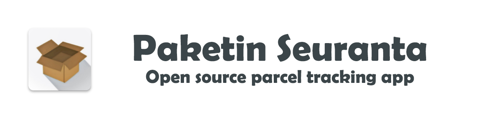

 

# Paketin Seuranta

Nitramite Paketin Seuranta *oli* pitkän historian omaava eri kuriirien toimitusten seuraamiseen 
tarkoitettu Android sovellus. Sovelluksen kohdeyleisö on Suomessa mutta pidetään repositorio 
yleisesti Englannin kielellä.

Paketin Seuranta is free application, no ads or paid content ever!


Table of contents
=================
* [Help required](#help-required)
* [Development environment](#dev-environment)
    * [Prerequisites](#prerequisites)
    * [Installing](#installing)
    * [Creating parcel logos](#creating-parcel-courier-logos)
* [Adding new courier](#adding-new-courier)
* [For participants](#for-participants)
* [Versioning](#versioning)
* [Author](#author)
* [Contributors](#contributors)
* [License](#license)

Help required
============

I am looking for help to develop this application further. If you are interested let me know,
contact me via email: nitramite@outlook.com

Development areas are: bug fixes, user interface, more tracking methods, better cleaner code and basic maintenance. 
Somebody with material design ui experience is especially welcome.

<b>Anyone with less or more coding experience is welcome. **Norkator** moderates that any contribution 
will be respected so no need to be scared to contribute.</b>

Android app: https://play.google.com/store/apps/details?id=com.nitramite.paketinseuranta


Dev environment
============

Prerequisites
-----
* Download latest [Android Studio](https://developer.android.com/studio)
    * Follow it's normal installation instructions.
    

Installing
-----

Steps to get development environment running

1. `git clone https://github.com/norkator/paketin-seuranta.git` or use gui like [Github Desktop](https://desktop.github.com/)
2. Open Android studio
3. Click `File` -> `Open` -> Select project root containing `app` folder.
4. Download all required SDK etc files. Android Studio automatically installs all required packages.
5. Happy developing!


Adding new courier
============
Good sample PR of such case is https://github.com/norkator/paketin-seuranta/pull/116

1. Creating parcel courier logos. I have been using following tool: [https://romannurik.github.io/AndroidAssetStudio/icons-launcher.html](https://romannurik.github.io/AndroidAssetStudio/icons-launcher.html)
2. Add new courier strategy at `/com.nitramite/courier` folder. Use others existing ones as sample.
3. Add carrier with new id at `CarrierUtils` see others as sample. Use unique integer id! and add created icon.
4. Add carrier to `UpdaterLogic` class.
5. Add carrier to `setCarrierSpinnerData` at `FragmentTrackedDelivery`.
6. Add carrier to `CarrierDetectorTask` if you want this new carrier is part of automatic detection tool.
7. Should now be available for use.


For participants
============

1. Let's keep Paketin Seuranta simple and respect privacy. 

2. No private servers /backends meaning only direct communication to parcel service provider apis.

3. I [norkator](https://github.com/norkator) will review and test pull requests. If everything looks and works 
according to rules pr will be merged. Otherwise I ask changes. Just give me time. This repo is not dead. 


Versioning
============
We use [Semver versioning](https://semver.org/)

```
Given a version number MAJOR.MINOR.PATCH, increment the:

MAJOR version when incompatible API changes are made,
MINOR version when backwards compatible features are added,
PATCH version when backwards compatible bug fixes are made.
```

Note that as a contributor you do not need to take versioning into account 
as the author **Norkator** is responsible of that.


Author
============
* **Norkator** - *Initial work, code owner* - [norkator](https://github.com/norkator)


Contributors
============
* **Ristomatti Airo** - *Tons of ideas and project management* - [ristomatti](https://github.com/ristomatti)
* **Developer From Jokela** - *Code improvements, upgrades, Firebase Cloud Messaging integration* - [developerfromjokela](https://github.com/developerfromjokela)
* **CostelliGraphics** - *New app logo*


License
============
GNU GENERAL PUBLIC LICENSE, V3  
To see more, open LICENSE file.
